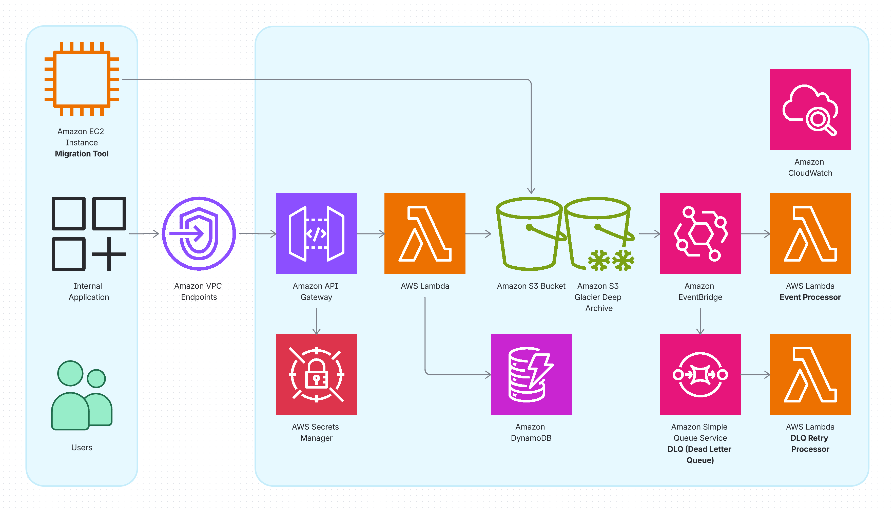
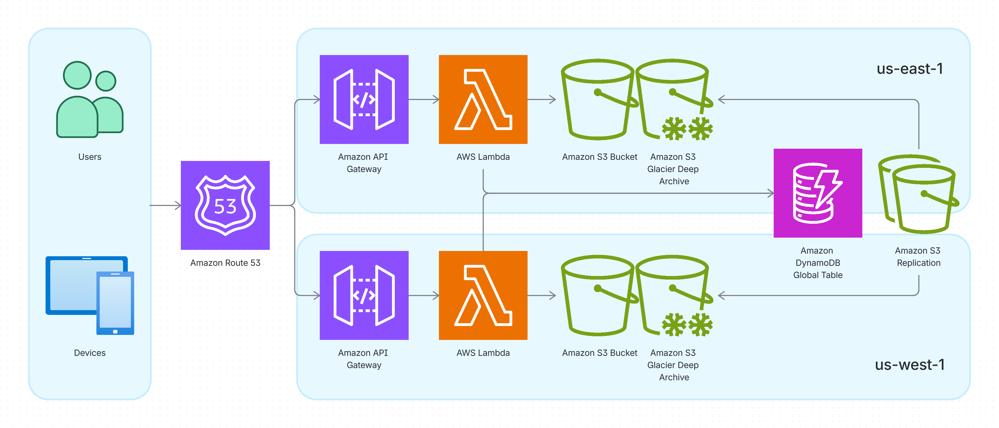

# ☁️ KumoCMS
### Enterprise-Grade Multi-Region Serverless Content Management

KumoCMS is an open-source, high-performance headless CMS built for global scale. By leveraging AWS Serverless primitives, it provides a "zero-ops" experience with built-in multi-region resilience, perfect for document management and content delivery in high-availability environments.

---

## ✨ Key Features

- 🌍 **Multi-Region Active-Active**: Built-in support for DynamoDB Global Tables and S3 Cross-Region Replication for sub-second data synchronization.
- ⚡ **Ultra-Low Latency**: Global traffic routing via S3 Multi-Region Access Points (MRAP) and Route 53 latency-based records.
- 📦 **Unlimited File Sizes**: Bypasses the 10MB API Gateway limit using S3 Pre-signed URLs for direct, secure client-side uploads.
- 🛡️ **Security First**: Native integration with AWS WAF for rate limiting and Amazon Cognito for robust JWT-based authentication.
- 💰 **Pay-as-you-go**: 100% Serverless. No servers to patch, no idle costs.

---

## 🏗️ Architecture

KumoCMS runs entirely on AWS managed services:

- **Frontend**: React hosted on S3 + CloudFront (Optional).
- **Compute**: Python-based AWS Lambda + API Gateway (Regional/Edge).
- **Database**: DynamoDB Global Tables (NoSQL).
- **Storage**: Simple Storage Service (S3).

---

## 📋 Use Cases

### Internal CMS

Deploy KumoCMS as a secure, internal document management system for your organization. Ideal for managing corporate documents, policies, and internal knowledge bases with controlled access.

### Active-Active Multi-Region Content Management

Leverage KumoCMS's multi-region architecture for global content delivery with automatic failover. Perfect for mission-critical applications requiring high availability and disaster recovery across geographic regions.

---

## 🧩 Components

KumoCMS is built from modular, reusable components:

### kumocms-lambda-python

**Repository**: [kumocms-lambda-python](https://github.com/kumocms/kumocms-lambda-python)

The core Python Lambda function code that powers the KumoCMS API. This repository contains all API handlers for document management operations including upload, retrieve, archive, restore, and delete.

**Key Features**:
- RESTful API handlers for document lifecycle management
- AWS Secrets Manager integration for API key authentication
- S3 pre-signed URL generation for direct client uploads
- Event-driven metadata extraction
- Comprehensive unit tests with mocking

**API Documentation**: [Swagger UI](./swagger.html) | [OpenAPI Spec](https://raw.githubusercontent.com/kumocms/kumocms-lambda-python/main/src/handlers/api/swagger.json)

### kumocms-vault-internal

**Repository**: [kumocms-vault-internal](https://github.com/kumocms/kumocms-vault-internal) *(Private)*

Complete Terraform infrastructure code for deploying KumoCMS as an internal document management system. This is a reference implementation that demonstrates how to deploy KumoCMS in a production environment.

**Key Features**:
- Consumes `kumocms-lambda-python` Lambda deployment package
- Uses `terraform-aws-kumocms-regional` module for regional resources
- Creates DynamoDB Global Tables for multi-region data replication
- Configures API Gateway with custom authorizer
- Sets up S3 buckets with encryption and lifecycle policies
- Manages AWS Secrets Manager for API keys

### terraform-aws-kumocms-regional

**Repository**: [terraform-aws-kumocms-regional](https://github.com/kumocms/terraform-aws-kumocms-regional)

Reusable Terraform module for provisioning regional KumoCMS resources. This module encapsulates all the AWS resources needed in a single region.

**Key Resources**:
- **API Gateway**: RESTful API with Lambda integrations and custom authorizer
- **Lambda Functions**: Document handlers and event processors
- **S3 Buckets**: Document storage with versioning and lifecycle policies
- **EventBridge Rules**: Automated metadata extraction and DLQ retry logic
- **SQS Queues**: Dead Letter Queue for failed operations
- **IAM Roles & Policies**: Least-privilege access for Lambda functions

---

## 🤝 Contributing

We love contributions! Whether it's a bug report, a new feature, or better documentation, please feel free to open an issue or submit a pull request.

For more details, please see our [**Contributing Guidelines**](./CONTRIBUTING.md).

1. Fork the Project
2. Create your Feature Branch (`git checkout -b feature/AmazingFeature`)
3. Commit your Changes (`git commit -m 'Add some AmazingFeature'`)
4. Push to the Branch (`git push origin feature/AmazingFeature`)
5. Open a Pull Request

---

## ⚖️ License

Distributed under the MIT License. See [**LICENSE**](./LICENSE) for more information.

---

### 📺 Resources
- **[Setting Up Cross-Region Replication for S3 Buckets](https://www.youtube.com/watch?v=dQw4w9WgXcQ)**: A practical guide to configuring S3 replication rules, a core component of the KumoCMS architecture.